# 📊 Блок-схемы функций PetHealth

Данный документ содержит блок-схемы (flowcharts) для всех основных функций приложения PetHealth.

---

## 🔐 1. Аутентификация и регистрация

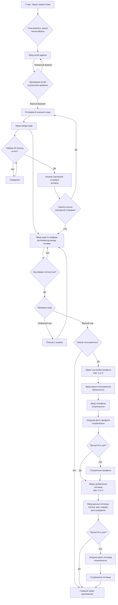

---

## 🐾 2. Добавление нового питомца

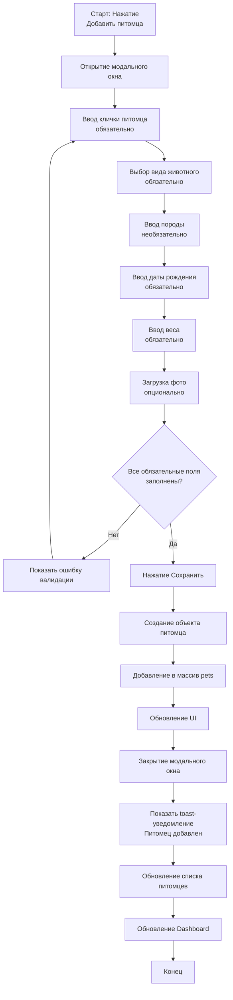

---

## 📝 3. Добавление медицинской записи

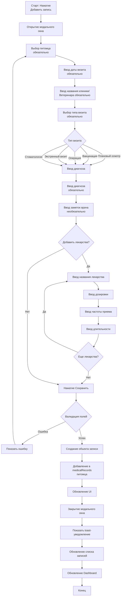

---

## 🩺 4. Добавление симптома в дневник

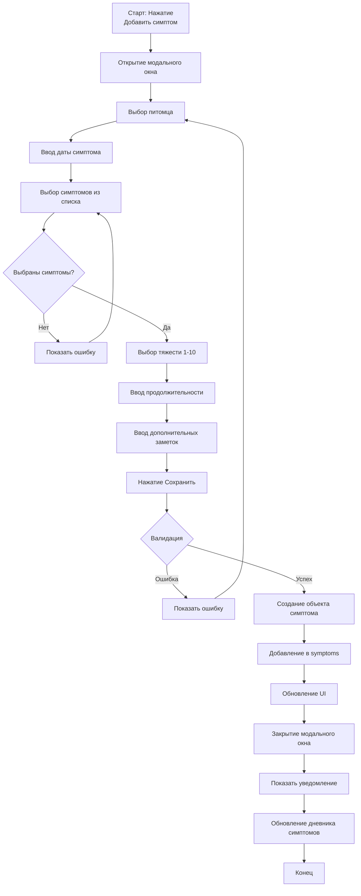

---

## 📅 5. Добавление события в календарь

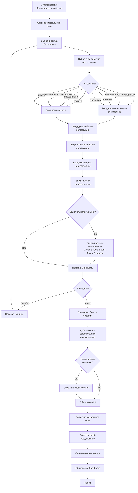

---

## 🧠 6. AI-Конспект визита

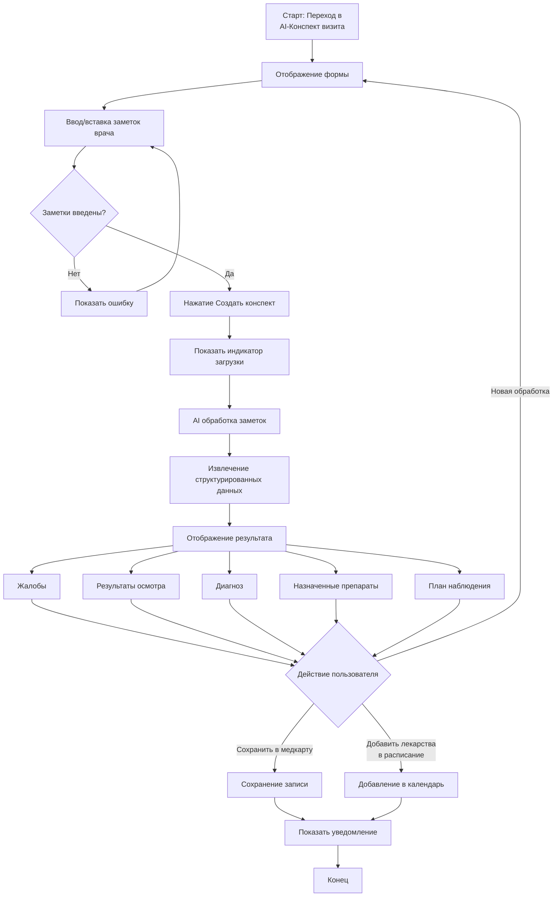

---

## 📸 7. AI-Сканер рецепта

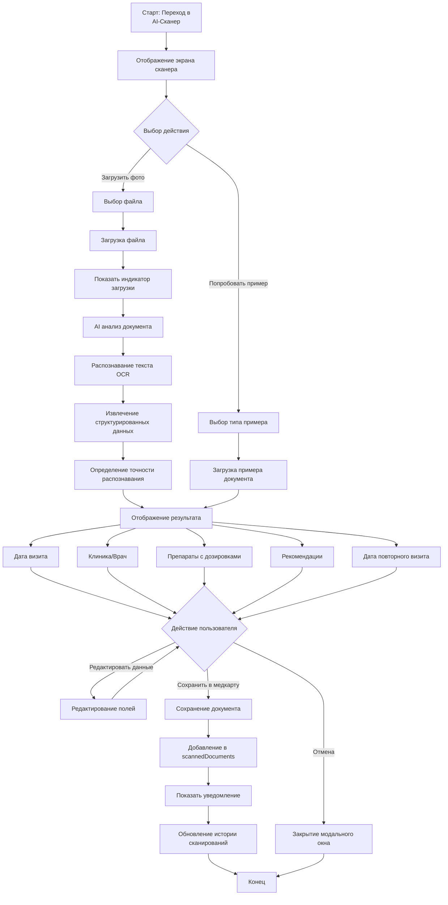

---

## 🔍 8. AI-Чекер симптомов

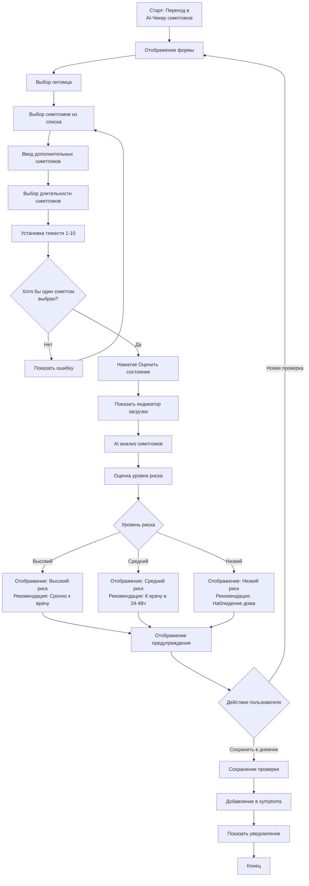

---

## 🍽️ 9. Добавление приема пищи

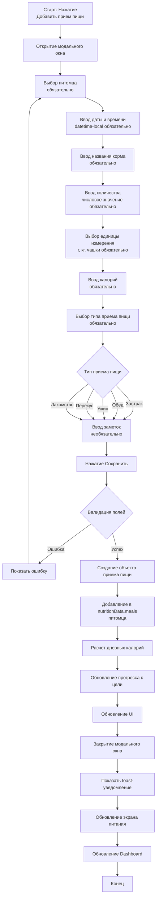

---

## ⚖️ 10. Установка цели по весу

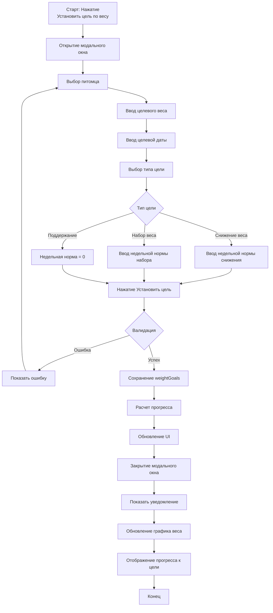

---

## 📤 11. Экспорт данных

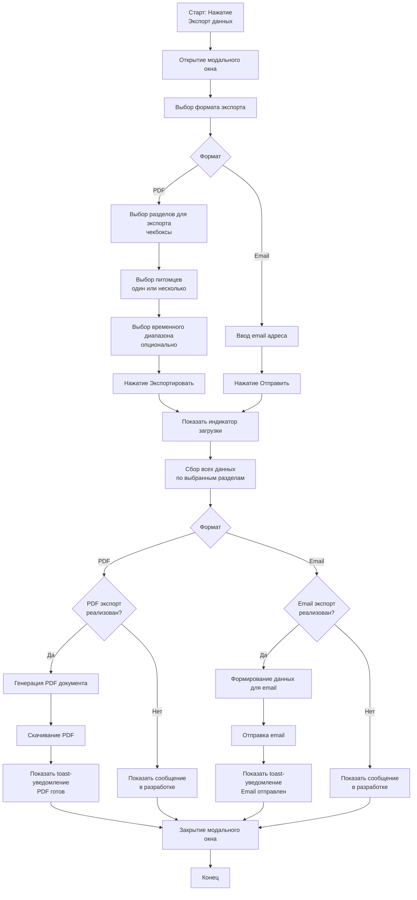

---

## 🗑️ 12. Удаление питомца

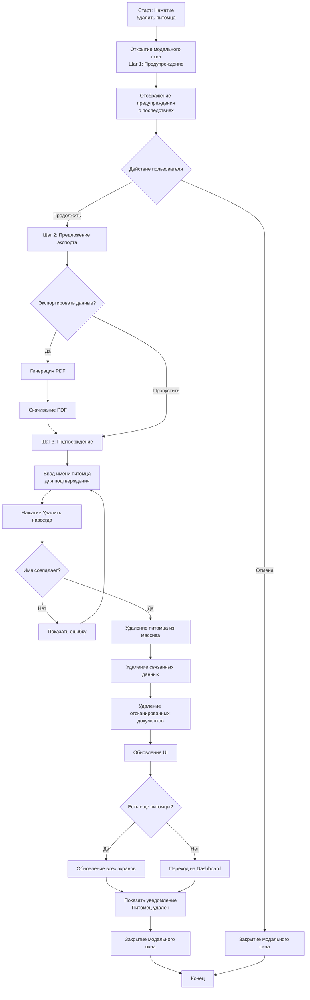

---

## 🔔 13. Обработка уведомлений

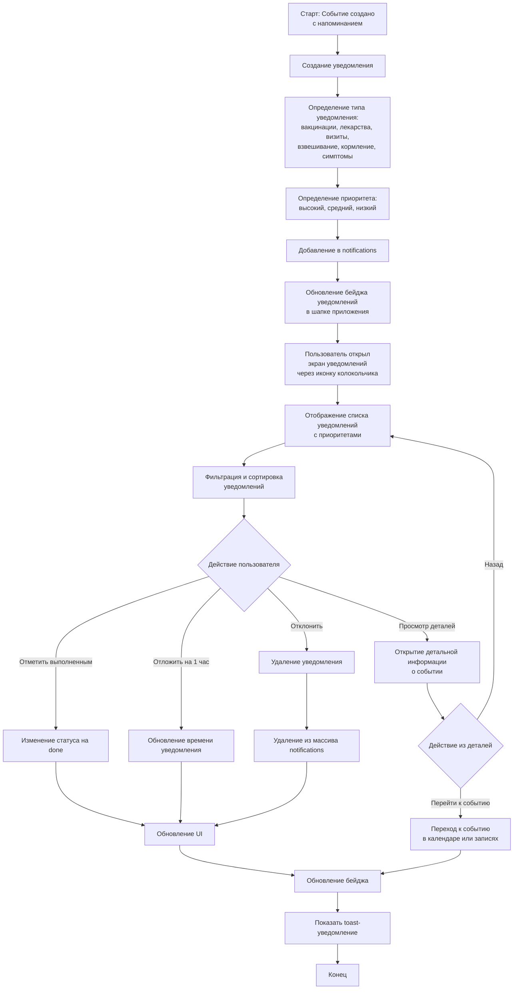

---

## 📊 14. Просмотр профиля питомца

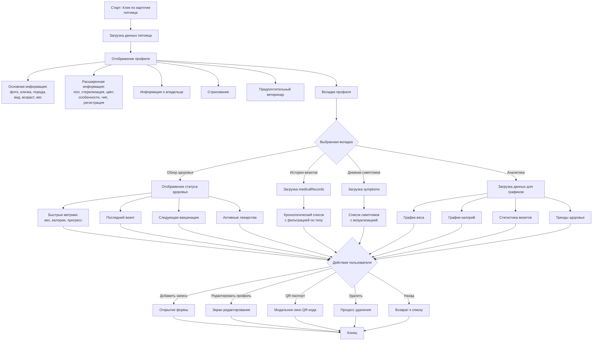

---

## 🔄 15. Общий поток работы приложения

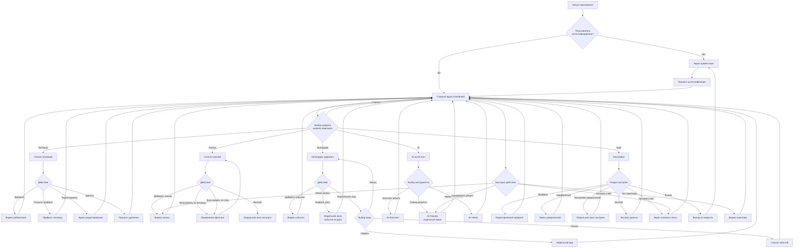

---

## 📝 Примечания

### Условные обозначения в блок-схемах:

- **Прямоугольники** — процессы/действия
- **Ромбы** — условия/решения
- **Скругленные прямоугольники** — начало/конец
- **Стрелки** — направление потока

### Формат диаграмм:

Все диаграммы созданы в формате **Mermaid**, который поддерживается:
- GitHub
- GitLab
- Большинство markdown-редакторов
- VS Code с расширением Mermaid
- Онлайн-редакторы (mermaid.live)

### Как использовать:

1. Скопируйте код диаграммы
2. Вставьте в markdown-файл или онлайн-редактор Mermaid
3. Диаграмма автоматически отобразится

---

---

## 📅 16. Просмотр календаря (три режима)

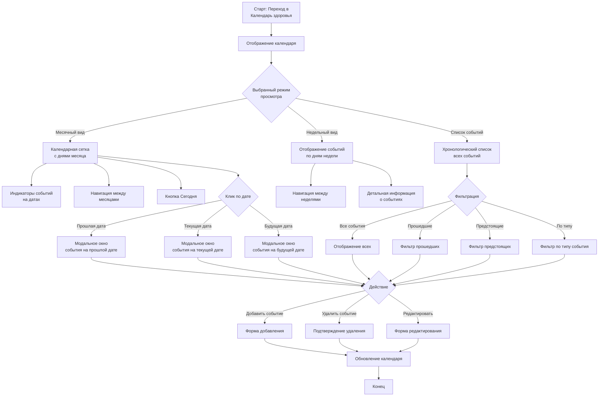

---

## 🍽️ 17. Просмотр питания и веса

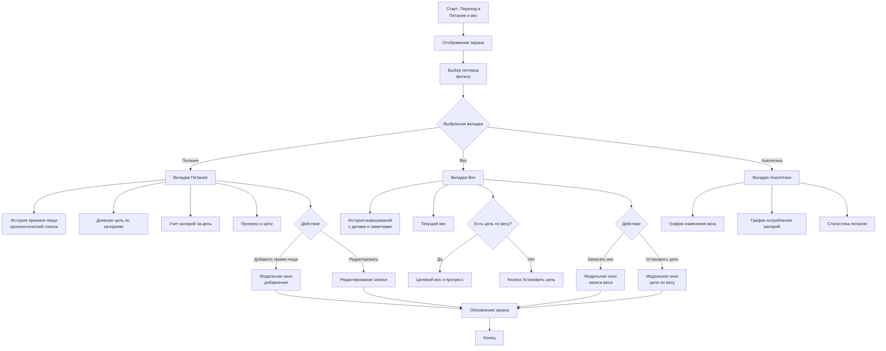

---

## 📋 18. Просмотр и фильтрация записей

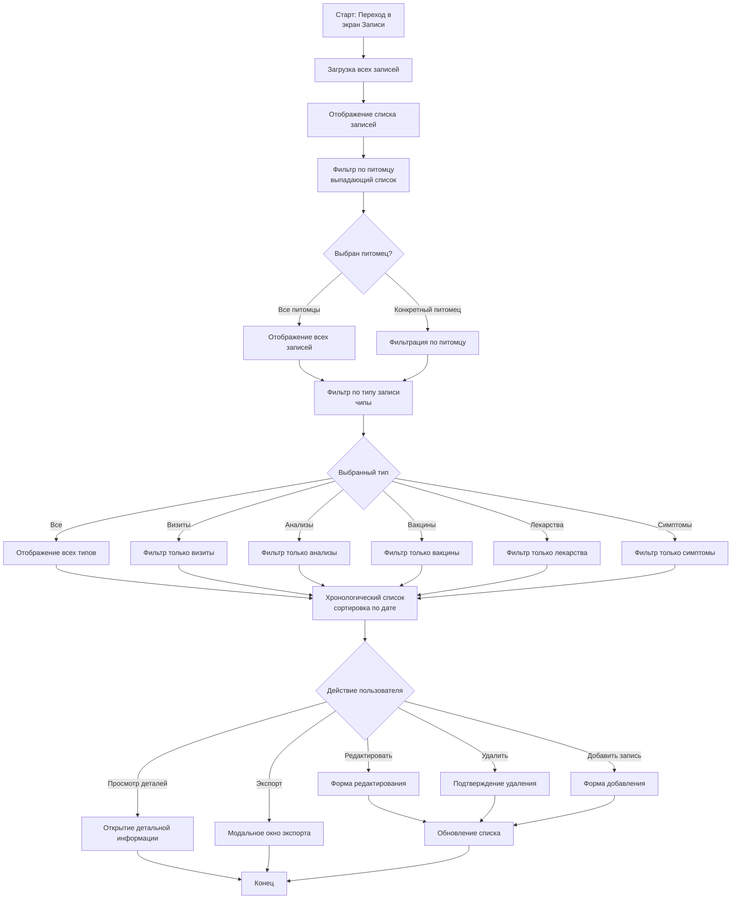

---

## ⚖️ 19. Запись веса

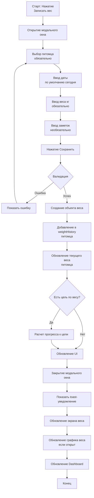

---

## ✏️ 20. Редактирование профиля питомца

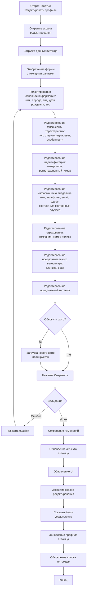

---

## 📱 21. Навигация по приложению

```mermaid
flowchart TD
    A[Запуск приложения] --> B{Аутентифицирован?}
    B -->|Нет| C[Экран приветствия]
    B -->|Да| D[Главный экран]
    C --> E[Аутентификация]
    E --> D
    D --> F[Нижняя панель навигации]
    F --> G{Выбор вкладки}
    G -->|🏠 Главная| D
    G -->|🐾 Питомцы| H[Список питомцев]
    G -->|📋 Записи| I[Список записей]
    G -->|📅 Календарь| J[Календарь здоровья]
    G -->|🧠 AI| K[AI-ассистент]
    G -->|⚙️ Ещё| L[Настройки]
    H --> M{Действие}
    M -->|Клик по карточке| N[Профиль питомца]
    M -->|Добавить| O[Форма добавления]
    I --> P{Действие}
    P -->|Фильтровать| Q[Применение фильтров]
    P -->|Добавить| R[Форма записи]
    J --> S{Действие}
    S -->|Выбрать дату| T[События на дате]
    S -->|Добавить| U[Форма события]
    K --> V{Выбор инструмента}
    V -->|Конспект| W[AI-Конспект]
    V -->|Сканер| X[AI-Сканер]
    V -->|Чекер| Y[AI-Чекер]
    L --> Z{Раздел}
    Z -->|Профиль| AA[Профиль пользователя]
    Z -->|Уведомления| AB[Экран уведомлений]
    Z -->|Питание и вес| AC[Экран питания и веса]
    Z -->|Экспорт| AD[Экспорт данных]
    Z -->|Выход| AE[Выход]
    N --> AF[Возврат к списку]
    O --> AF
    AF --> H
    Q --> I
    R --> I
    T --> J
    U --> J
    W --> K
    X --> K
    Y --> K
    AA --> L
    AB --> L
    AC --> L
    AD --> L
    AE --> C
```

---

---

## 📝 Примечания

### Условные обозначения в блок-схемах:

- **Прямоугольники** — процессы/действия
- **Ромбы** — условия/решения
- **Скругленные прямоугольники** — начало/конец
- **Стрелки** — направление потока

### Формат диаграмм:

Все диаграммы созданы в формате **Mermaid**, который поддерживается:
- GitHub
- GitLab
- Большинство markdown-редакторов
- VS Code с расширением Mermaid
- Онлайн-редакторы (mermaid.live)

### Как использовать:

1. Скопируйте код диаграммы
2. Вставьте в markdown-файл или онлайн-редактор Mermaid
3. Диаграмма автоматически отобразится

### Обновления схем:

Все схемы обновлены на основе актуальной документации FEATURES.md (версия 4.0.0) и отражают:
- Текущую реализацию функций
- Структуру данных приложения
- Навигацию между экранами
- Модальные окна и формы
- Фильтрацию и поиск
- Три режима просмотра календаря
- Отдельный экран питания и веса с вкладками
- Расширенную информацию о питомцах
- Систему уведомлений с приоритетами

---

---

## 📝 22. Запись состояния питомца за день (Daily Status Log)

```mermaid
flowchart TD
    A[Старт: Нажатие<br/>Записать состояние] --> B[Открытие модального окна]
    B --> C[Выбор питомца<br/>обязательно]
    C --> D[Ввод даты<br/>по умолчанию сегодня]
    D --> E[Установка оценки состояния<br/>шкала 1-10]
    E --> F[Выбор настроения:<br/>отлично, хорошо, нормально,<br/>грустно, тревожно, устал]
    F --> G[Ввод комментария<br/>необязательно]
    G --> H[Нажатие Сохранить]
    H --> I{Валидация}
    I -->|Ошибка| J[Показать ошибку]
    J --> C
    I -->|Успех| K{Есть запись<br/>за эту дату?}
    K -->|Да| L[Обновление существующей записи]
    K -->|Нет| M[Создание новой записи]
    L --> N[Добавление в dailyStatusLogs<br/>питомца]
    M --> N
    N --> O[Сортировка по дате<br/>новые сверху]
    O --> P[Обновление UI]
    P --> Q[Закрытие модального окна]
    Q --> R[Показать toast-уведомление]
    R --> S[Обновление главного экрана]
    S --> T[Конец]
```

---

## 🤖 23. AI Рекомендации

```mermaid
flowchart TD
    A[Старт: Открытие<br/>главного экрана] --> B[Проверка последней<br/>рекомендации]
    B --> C{Прошло 7+ дней<br/>с последней рекомендации?}
    C -->|Да| D[Генерация новой рекомендации]
    C -->|Нет| E[Использование существующей]
    D --> F[Анализ данных питомца:<br/>питание, вес, активность,<br/>медицинские записи]
    F --> G[Расчет оценки здоровья<br/>healthScore 1-10]
    G --> H[Определение статуса:<br/>positive, warning, critical]
    H --> I[Формирование рекомендаций]
    I --> J[Создание объекта рекомендации]
    J --> K[Добавление в aiRecommendations]
    K --> L[Отображение на главном экране]
    E --> L
    L --> M{Действие пользователя}
    M -->|Раскрыть детали| N[Отображение детального анализа:<br/>питание, вес, активность, медицина]
    M -->|Просмотр истории| O[Открытие модального окна<br/>с историей рекомендаций]
    N --> P[Конец]
    O --> Q[Отображение всех рекомендаций<br/>сортировка по дате]
    Q --> P
```

---

## 🔄 24. Обновленный общий поток работы приложения

```mermaid
flowchart TD
    A[Запуск приложения] --> B{Пользователь<br/>аутентифицирован?}
    B -->|Нет| C[Экран приветствия]
    B -->|Да| D[Главный экран Dashboard]
    C --> E[Процесс аутентификации]
    E --> D
    D --> F{Выбор раздела<br/>нижняя навигация}
    F -->|Главная| D
    F -->|Питомцы| G[Список питомцев]
    F -->|Календарь| H[Календарь здоровья]
    F -->|Питание| I[Питание и вес]
    F -->|AI| J[AI-ассистент]
    D --> K{Быстрые действия}
    K -->|Записать состояние| L[Модальное окно<br/>Daily Status]
    K -->|Добавить прием пищи| M[Модальное окно<br/>приема пищи]
    K -->|Лог симптома| N[Модальное окно<br/>симптома]
    K -->|Новая запись| O[Модальное окно<br/>медицинской записи]
    K -->|Сканировать рецепт| P[AI-Сканер]
    G --> Q{Действие}
    Q -->|Добавить| R[Форма добавления]
    Q -->|Открыть профиль| S[Профиль питомца]
    Q -->|Редактировать| T[Экран редактирования]
    Q -->|Удалить| U[Процесс удаления]
    H --> V{Действие}
    V -->|Добавить событие| W[Форма события]
    V -->|Выбрать дату| X[Модальное окно<br/>события на дате]
    I --> Y{Действие}
    Y -->|Добавить прием| M
    Y -->|Записать вес| Z[Модальное окно веса]
    J --> AA{Выбор инструмента}
    AA -->|Конспект визита| AB[AI-Конспект]
    AA -->|Сканер рецепта| P
    AA -->|Чекер симптомов| AC[AI-Чекер]
    D --> AD{Экран Ещё<br/>через шапку}
    AD -->|Записи| AE[Список записей]
    AD -->|Настройки| AF[Настройки]
    AD -->|Уведомления| AG[Экран уведомлений]
    L --> D
    M --> D
    N --> D
    O --> D
    P --> D
    R --> D
    S --> D
    T --> D
    U --> D
    W --> D
    X --> D
    Z --> D
    AB --> D
    AC --> D
    AE --> D
    AF --> D
    AG --> D
```

---

*Документация обновлена: Декабрь 2025*

