# 📊 Блок-схемы функций PetHealth

Данный документ содержит блок-схемы (flowcharts) для всех основных функций приложения PetHealth.

---

## 🔐 1. Аутентификация и регистрация

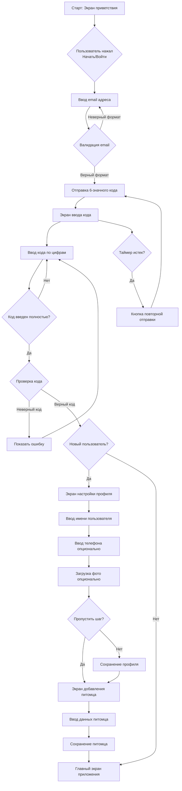

---

## 🐾 2. Добавление нового питомца

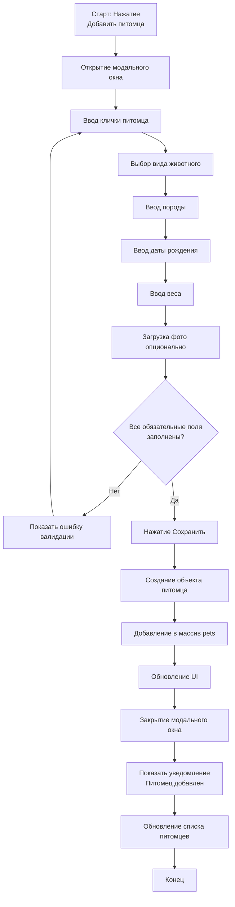

---

## 📝 3. Добавление медицинской записи

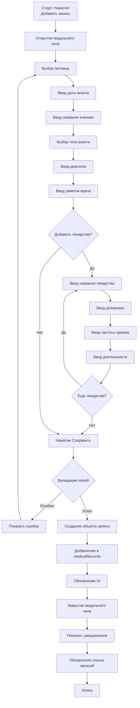

---

## 🩺 4. Добавление симптома в дневник

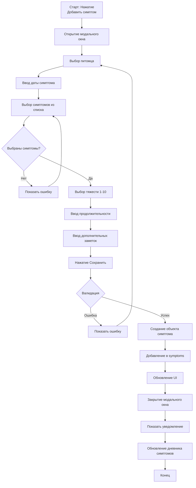

---

## 📅 5. Добавление события в календарь

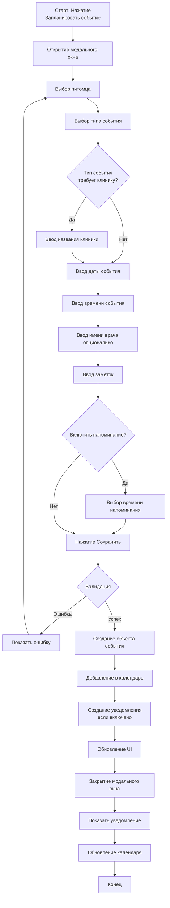

---

## 🧠 6. AI-Конспект визита

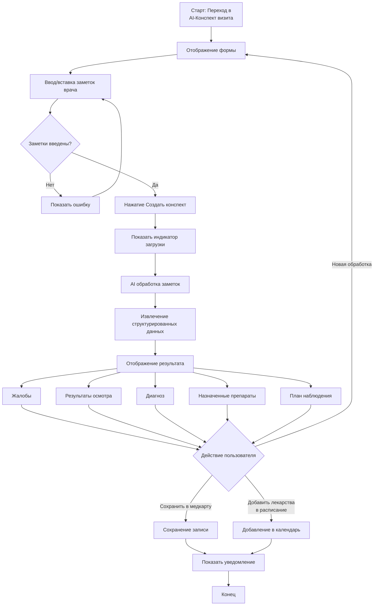

---

## 📸 7. AI-Сканер рецепта

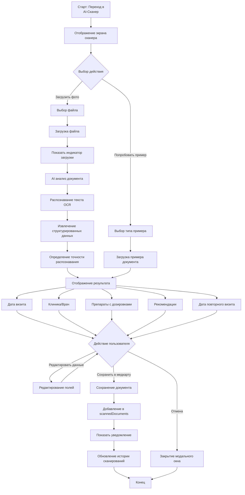

---

## 🔍 8. AI-Чекер симптомов

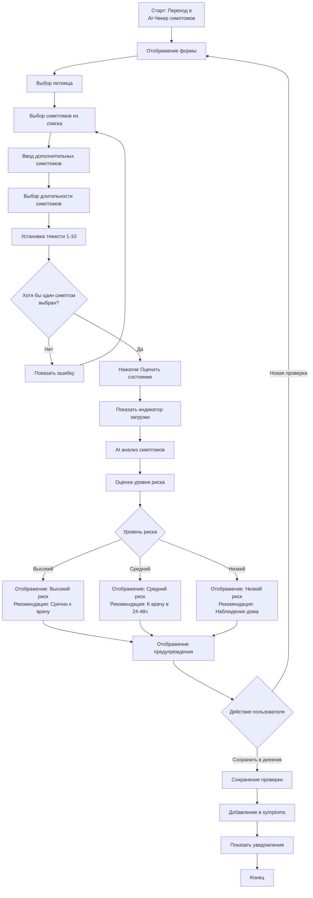

---

## 🍽️ 9. Добавление приема пищи

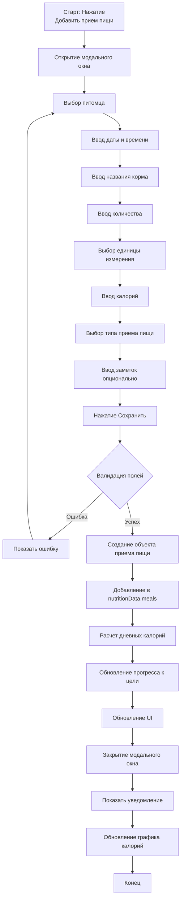

---

## ⚖️ 10. Установка цели по весу

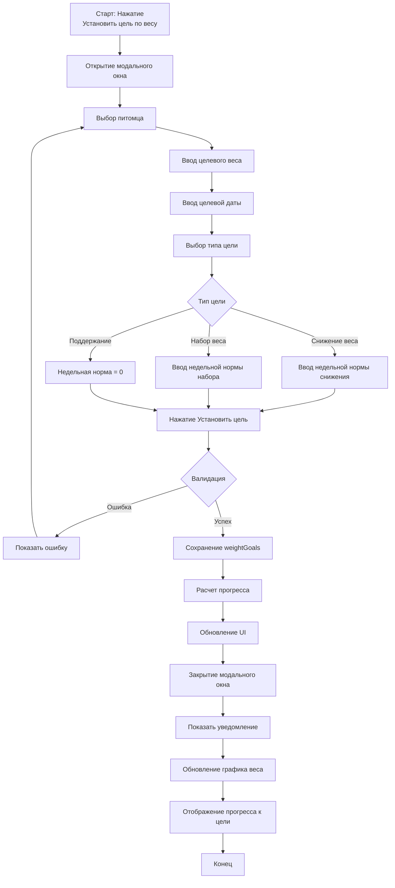

---

## 📤 11. Экспорт данных

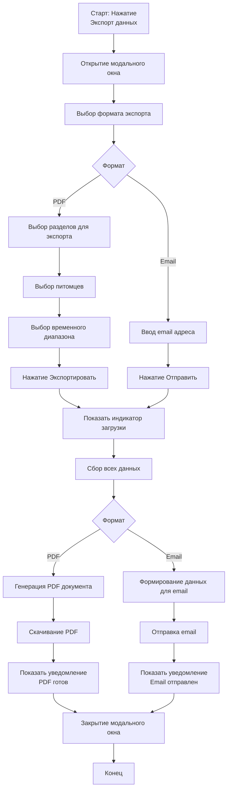

---

## 🗑️ 12. Удаление питомца

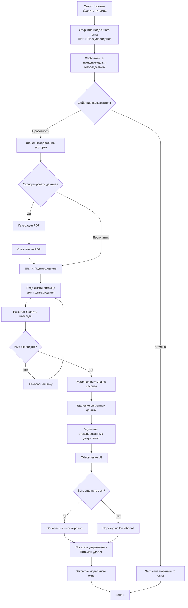

---

## 🔔 13. Обработка уведомлений

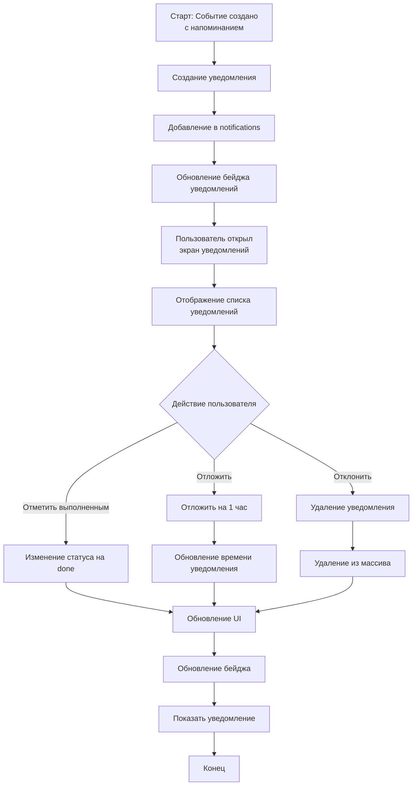

---

## 📊 14. Просмотр профиля питомца

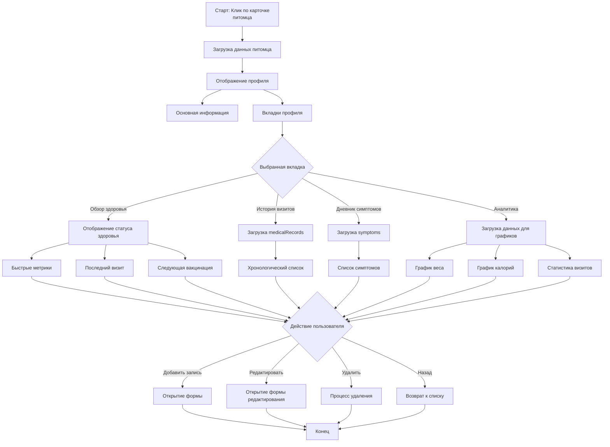

---

## 🔄 15. Общий поток работы приложения

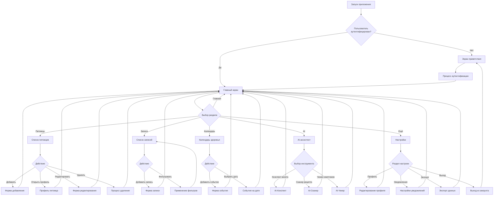

---

## 📝 Примечания

### Условные обозначения в блок-схемах:

- **Прямоугольники** — процессы/действия
- **Ромбы** — условия/решения
- **Скругленные прямоугольники** — начало/конец
- **Стрелки** — направление потока

### Формат диаграмм:

Все диаграммы созданы в формате **Mermaid**, который поддерживается:
- GitHub
- GitLab
- Большинство markdown-редакторов
- VS Code с расширением Mermaid
- Онлайн-редакторы (mermaid.live)

### Как использовать:

1. Скопируйте код диаграммы
2. Вставьте в markdown-файл или онлайн-редактор Mermaid
3. Диаграмма автоматически отобразится

---

*Документация обновлена: Ноябрь 2025*

